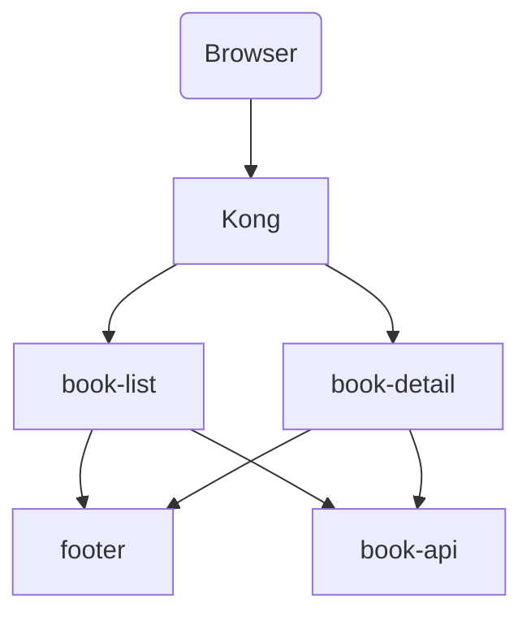

## Kong Micro Front End Example
An example implementation of Micro Front Ends using kong to route to the different front ends.

#### Getting started

Before running anythign make sure you are on the correct node version. There is a .nvmrc file so you can run `nvm use` if you have it installed. Next install all the dependencies by running `npm install` in the root directory.

A docker-compose file is provided in the root of this project. Install Docker and run `docker-compose up -d` inside this project. Only Kong is exposed by docker and it is available at <http://localhost:8000/>.

#### Archectecture

The book data is provided by `book-api` which is used by both front ends. The root list view and the book detail view are both seporate applications called `book-list` and `book-detail` respectivly. Both view services have a footer component, this is provided by `footer`. `footer` returns partial HTML, services request this content and embed it in their response HTML.

